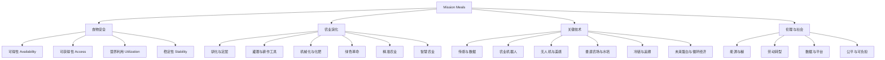
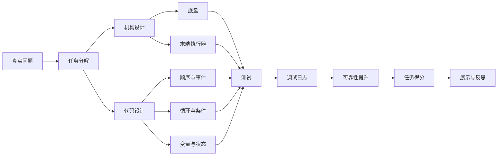
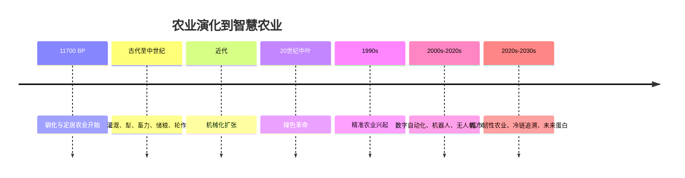

# 新加坡 NRC 2026“Mission Meals”深度研究与教师学生一体化学习方案

## 执行摘要

2026 年新加坡 NRC 的官方主题已经由 entity["organization","Science Centre Singapore","science museum singapore"] 公布为 **“Mission Meals”**。官方页面确认了 2026 赛季、规则分类、适用硬件与挑战文档入口；公开赛事支持页进一步把这一主题概括为四个挑战领域：**Food Production Infrastructure（食品生产基础设施）**、**Labour-Intensive Farming（高劳动密度农业环节自动化）**、**Food Logistics（食品物流）**、以及 **End-Effector Design（末端执行器设计，Bonus）**。这意味着备赛不能只做“一个机器人”，而应同时建立三层能力：对“食物系统”的系统认知、把现实问题抽象成机器任务的能力、以及把任务落地为 Scratch/积木程序与机构的工程能力。citeturn41view0turn44search1turn33view0

对学校最重要的结论有三条。第一，**若目标是 NRC Lower Primary**，使用 **Scratch 思维 + entity["company","乐高教育","education toys"] SPIKE Essential** 非常契合官方规则，因为 Lower Primary 硬件就是 SPIKE Essential/WeDo 2.0；第二，**若目标是 NRC Upper Primary**，SPIKE Essential 仍非常适合做 6–12 周的前置训练，但应在中后段过渡到 SPIKE Prime 或等效硬件，因为 Upper Primary 官方常规赛硬件是 SPIKE Prime/EV3/Robot Inventor；第三，针对初学者，先用纯 Scratch 或屏幕内块编程建立“顺序—循环—条件—调试”的心智模型，再接硬件，通常比一上来就机械搭建更稳，这与近年的 Scratch 教学综述和部分年级研究结论一致。citeturn41view0turn32view0turn40view0turn29search21turn39view2

就课程实施而言，我建议把整个备赛拆成两大板块：**A 区为系统化科普学习**，目标是让学生真正理解“为什么要解决这个问题”；**B 区为机器人实现学习**，目标是让学生把“问题—任务—机构—代码—测试—复盘”闭环跑通。理想配比是 **A:B ≈ 6:4**；当赛前时间不足时，可以压缩到 **5:5**，但不建议完全跳过 A 区，因为 Mission Meals 不是单纯跑分主题，而是明显面向 **联合国 SDG 2 零饥饿** 与综合食物系统思维。世界仍远未走到“零饥饿”，全球饥饿人口与食物浪费、热浪冲击、供应链脆弱性问题并存；而新加坡又是一个高度依赖进口、同时持续推进本地韧性生产与食品系统创新的城市国家，因此这个主题天然适合做跨学科项目式学习。citeturn34search3turn34search4turn35search0turn35search3turn12search0turn12search3turn10search2

如果让教师直接采纳，我的建议是：**24 周作为理想完整轨道，12 周作为标准学期轨道，6 周作为冲刺轨道**。24 周可以完成“科普—机构—编码—场地—综合任务—展示”全闭环；12 周适合有每周固定 CCA/STEM 时段的学校；6 周则只适合聚焦 1–2 个任务族，比如“生产基础设施 + 运输物流”，而不适合追求覆盖全部知识面。这个建议同时参考了官方 SPIKE Essential 的课程结构（5 个单元、每单元 6–10 小时）、Scratch 教学资源的脚手架逻辑，以及教育研究对初学者认知负荷与教师实施难点的总结。citeturn32view0turn31view0turn28search7turn28search12turn39view2turn40view0

## 官方主题与教学设计原则

NRC 官方结构已经给了课程设计非常清晰的边界。按 entity["organization","新加坡教育部","education ministry singapore"] 支持、由 Science Centre Singapore 公布的 2026 页面，**Regular Category** 是“在场地上完成任务的自主机器人竞赛”；**Open Category** 是“围绕年度主题做真实世界问题解决的项目展示”；**AI Maker Series** 强调 AI/ML 模型与机器人完成挑战；**Preschool** 则是低龄任务式编程。对常规赛尤其关键的是官方硬件边界：Lower Primary 为 SPIKE Essential/WeDo 2.0，Upper Primary 与 Secondary 为 SPIKE Prime/EV3/Robot Inventor。也就是说，本报告的 B 区方案对 Lower Primary 是直接对位，对 Upper Primary/Secondary 则更像系统预科与技能底座。citeturn41view0

关于 “Mission Meals” 的内容维度，目前最高置信度的公开表述应写成这样：**官方页面确认主题并链接挑战文档；公开赛事支持/解读页把四个挑战领域总结为生产基础设施、劳动密集型农业自动化、食品物流、以及奖励性的多工具末端执行器设计。**由于详细 playfield、得分细则和 mission wording 在官方 Google Drive 文档里，这里建议学校最终打印讲义前，再逐项对照官方 challenge documents 与 FAQ。citeturn41view0turn44search1

基于这一主题，我建议教师把“竞赛语言”翻译成“学科语言”。最有效的做法不是让学生死记 mission 名称，而是把它们归到“食物系统”的四个层面：**生产、加工/操作、流通、工具能力**。这样学生更容易把知识迁移到任意一张新赛图上。以下映射表可直接用于课程导入。

| 竞赛挑战领域 | 学科问题 | 机器人任务抽象 | 课堂关键词 |
|---|---|---|---|
| Food Production Infrastructure | 如何在有限土地、热环境、缺水或城市环境中稳定生产食物 | 路径导航、环境触发、平台搭建、状态反馈 | 温室、垂直农场、水培、传感、控光控温 |
| Labour-Intensive Farming | 哪些环节最适合自动化以减轻劳动强度 | 抓取、推动、翻转、分拣、重复作业 | 收获、授粉、除草、分类、效率 |
| Food Logistics | 食物怎样更快、更安全、更少损耗地送到需要的地方 | 取放、路线规划、停靠、颜色/标记识别 | 冷链、仓储、追踪、配送、损耗 |
| End-Effector Design | 一个机器人如何通过“换工具”完成多种任务 | 模块化结构、快速换装、动作复用 | 夹爪、铲臂、推杆、挂钩、接口标准 |

这个映射并不是官方规则文本，而是我基于赛事主题、食物系统研究、以及比赛常见任务抽象后给出的“教学层翻译”。它的价值在于：学生在看见一项 mission 时，不会只想着“怎么得分”，而会自然问出“这个动作在现实世界里对应食物系统的哪一个环节”。这对 Open Category、Regular Category，甚至 AI Maker 的项目陈述都非常有帮助。citeturn41view0turn44search1turn34search3turn10search2

## 总体课程架构与知识图谱

整个学习方案建议遵循一个简单但很稳的螺旋模型：**先理解系统，再抽象任务，再落到机构与程序，随后进入基于数据的测试与复盘，最后回到“这个机器人为什么有意义”的主题表达。** 这也是为什么我不建议把 Mission Meals 只当成“赛图训练”。Scratch 教学综述表明，脚手架、任务分层和协作设计会显著影响学习效果；教师实践研究也说明，若没有明确的课程结构，学生会停留在“试错很多、迁移很少”的状态。citeturn40view0turn39view2

**知识图谱 A：系统科普板块（文字版）**

食物安全 → 可得性 / 可获得性 / 营养利用 / 稳定性
农业演化 → 驯化 → 灌溉与工具 → 机械化 → 绿色革命 → 精准农业 → 智慧农业
城市与气候约束 → 热浪 / 水 / 能源 / 土地 / 进口依赖
当前技术 → 传感 / 遥感 / 机器人 / 无人机 / 室内农业 / 冷链 / 追溯 / 未来蛋白
未来情景 → 高韧性本地循环 / 超自动化平台型食物系统 / 高温冲击适应系统
伦理议题 → 能源代价 / 数据主权 / 劳动转型 / 可负担性 / 生物多样性



**知识图谱 B：Scratch + SPIKE Essential 机器人板块（文字版）**

问题定义 → 任务分解 → 机械原型 → 传感逻辑 → 程序结构 → 调试 → 稳定性 → 展示表达
程序能力 → 顺序 / 事件 / 循环 / 条件 / 变量 / 状态
机械能力 → 底盘 / 转向 / 取放 / 推送 / 模块化换装
竞赛能力 → 规则阅读 / 可靠性统计 / Pit-stop 调整 / 团队分工 / 口头陈述



### 多轨道总览

以下三条轨道是**建议版学校课程**，不是官方赛程。其设计依据是：NRC 的硬件分层、SPIKE Essential 的官方课程体量、Scratch 和教育机器人教学研究，以及食物系统主题的跨学科密度。citeturn41view0turn32view0turn40view0turn29search22

| 轨道 | 建议对象 | 每周节奏 | 核心目标 | 典型成果 |
|---|---|---|---|---|
| 24 周完整轨道 | 学校 STEM 俱乐部 / CCA / 学期制项目 | 每周 90–120 分钟 | 建立完整“主题—工程—展示”闭环 | 主题研究册、概念图、3–4 个机器人原型、完整演示 |
| 12 周标准轨道 | 学期内集中备赛 | 每周 90–120 分钟 | 以 2 个主题族为中心进行深练 | 1 个主机器人、1 个备份机构、测试日志、展示稿 |
| 6 周冲刺轨道 | 已有基础的赛前加速 | 每周 120–180 分钟 | 快速聚焦、围绕 1–2 个得分路径冲刺 | 1 条稳定路线、关键工具头、10-run 可靠性记录 |

### 二十四周完整轨道

| 周次 | A 区系统科普 | B 区机器人实现 | 课堂活动 | 周产出 |
|---|---|---|---|---|
| W1 | 认识 Mission Meals 与食物安全四维度 | 认识 SPIKE Essential 套件与分工 | 主题导入、器材认领 | 团队角色卡 |
| W2 | 新加坡食品系统现实：进口依赖与本地韧性 | Hub、马达、颜色传感器初探 | 观察本地案例、基础连接 | 器材清单与安全规范 |
| W3 | 农业从起源到定居社会 | 直行、转弯、停靠基础 | 路径校准 | 底盘 v1 |
| W4 | 灌溉、耕作工具与效率革命 | 顺序与事件编程 | “一条路线三种写法” | 程序 v1 |
| W5 | 机械化、化肥与绿色革命 | 循环与条件 | 比较广播式与精准式动作 | 程序 v2 |
| W6 | 精准农业与智慧农业概念 | 颜色触发与简单状态机 | 颜色点停靠任务 | 颜色表与阈值记录 |
| W7 | 垂直农场、水培、室内农业 | 推杆/铲臂/夹爪机构原型 | 三种末端执行器快做 | 工具头 x3 |
| W8 | 新加坡本地城市农业案例 | 机构快速迭代 | “20 分钟重构赛” | 机构 v2 |
| W9 | 无人机、遥感与农田数据 | 路线复用与变量 | 计数、重复搬运 | 搬运逻辑 |
| W10 | 高劳动密度农业环节为何适合自动化 | 多步骤任务串联 | 收获—搬运—释放流程 | 综合任务 v1 |
| W11 | 食品物流、冷链与损耗 | 停靠、装卸、节拍控制 | 模拟冷链配送 | 综合任务 v2 |
| W12 | 区块链/追溯/仓储自动化的意义 | 测试协议建立 | 5-run 测试 | 首轮可靠性表 |
| W13 | 食物浪费、循环经济与再利用 | 失败分类与调试方法 | 单变量调参 | Bug 清单 |
| W14 | 极端高温、气候风险与农业 | 10-run 稳定性验证 | 热启动/冷启动对比 | 可靠性改进 |
| W15 | 能源—水—土地三难题 | Light Matrix 状态反馈 | 用灯阵表达任务状态 | 交互反馈模块 |
| W16 | 未来蛋白、细胞农业、昆虫与发酵 | 模块化末端执行器设计 | Bonus 工具头设计 | 快换接口原型 |
| W17 | 科技不等于万能：能耗、成本、公平 | 比赛规则精读 | 把规则翻成工程清单 | 规则—任务对照表 |
| W18 | 田野案例比较：哪类技术真实可扩展 | 摆位与发车策略 | 场地流程演练 | 发车标准作业 |
| W19 | 未来 100 年食物系统情景构建 | 项目叙事与展示逻辑 | 口头解释“为什么这样设计” | 90 秒说明稿 |
| W20 | 数据可视化与证据表达 | 视频记录与复盘 | 慢动作回看 | 复盘日志 |
| W21 | 开放式综合挑战设计 | 小型内部模拟赛 | 同伴互评 | 评分记录 |
| W22 | 展示美化与说明板优化 | 机构定型与备份方案 | 关键备件包整理 | 备件清单 |
| W23 | 最终主题陈述打磨 | 全流程彩排 | 一次完整演示 | 彩排视频 |
| W24 | 总结：从 food system 到 robot system | 终评与反思 | 成果展/校内 demo day | 最终档案袋 |

### 十二周标准轨道

| 周次 | 模块主题 | 关键目标 | 主要产出 |
|---|---|---|---|
| W1 | 主题导入 + 食物系统基础 | 读懂 Mission Meals | 概念图 |
| W2 | 新加坡与全球 food security | 建立现实语境 | 案例笔记 |
| W3 | SPIKE Essential 基础运动 | 稳定底盘 | 底盘 v1 |
| W4 | 顺序/循环/条件 | 搭出可靠动作逻辑 | 程序 v1 |
| W5 | 生产基础设施任务组 | 做“种植/环境”类任务 | 工具头 v1 |
| W6 | 劳动密集型农业任务组 | 做“收获/分拣”类任务 | 综合任务 v1 |
| W7 | 物流任务组 | 做“运输/停靠/释放”类任务 | 综合任务 v2 |
| W8 | 末端执行器 Bonus | 做快换工具设计 | 接口模块 |
| W9 | 调试与可靠性 | 跑 10 次并记录 | 测试表 |
| W10 | 规则映射 + 优化 | 围绕得分与失分点修正 | 최종程序 |
| W11 | 展示与讲解 | 学会讲清楚“问题—方案—证据” | 展示稿 |
| W12 | 模拟赛与终评 | 完成演示闭环 | 档案袋 |

### 六周冲刺轨道

| 周次 | 聚焦主题 | 课堂重点 | 评估任务 |
|---|---|---|---|
| W1 | 规则拆解 + 设备上手 | 确定 1–2 条任务路线 | 任务优先级表 |
| W2 | 底盘与停靠 | 走直、转向、识别标记 | 路线完成率 |
| W3 | 一种主末端执行器 | 推/夹/翻三选一 | 工具效率测试 |
| W4 | 综合任务串联 | 完成完整流程 | 5-run 成功率 |
| W5 | 调试与备份方案 | 单变量优化、建立 pit checklist | 10-run 成功率 |
| W6 | 展示与赛前演练 | 90 秒陈述 + 全流程彩排 | 最终评分 |

### 学习目标、先修要求、成果与评估

| 维度 | 建议表述 |
|---|---|
| 学习目标 | 认识 food security 与城市食物系统；理解农业技术演化；能把真实问题转化为机器人任务；能用 Scratch 思维与 SPIKE Essential 完成顺序、循环、条件、状态、调试；能基于证据展示设计选择 |
| 先修要求 | 无编程基础可入门；若学生低年级，建议先做 1–2 次无硬件 Scratch 或纸上流程图；若教师首次带队，建议先完成官方 Getting Started 和 1 个示范单元 |
| 学习成果 | 主题概念图、案例对比表、机器人原型、10-run 测试日志、演示视频、展示讲稿 |
| 评估任务 | 形成性评估：概念图、机构草图、程序解释、测试日志；总结性评估：主题理解、任务完成、可靠性、展示表达 |
| 课堂活动 | 规则翻译工作坊、场地观察、结构快做赛、颜色阈值实验、失效分类、同伴复盘、口头答辩 |

## 板块 A：Mission Meals 主题的系统化科普学习

### A.1 从农业起源到智慧农业的长时段演化

农业的起点，不是“有了农田”这么简单，而是**人类把野生物种逐步拉进可管理系统**的过程。最新综述把这一转变放在约 **11,700 年前** 左右，核心变化在于驯化、定居、食物储存与生产组织方式的重构。换句话说，农业本质上是“把不确定的食物获取，转化为可计划的食物系统”。这是 Mission Meals 最应该先讲清楚的第一层。citeturn13search0turn13search1

之后几千年里，农业的关键技术线索可以概括为：**水控制、力控制、时间控制、信息控制**。灌溉、犁、畜力和轮作，解决了“如何扩大可耕作规模”；机械化和化肥则解决了“如何在有限劳动下提高单位面积产出”；20 世纪中叶的绿色革命进一步把高产品种、灌溉、农药和化肥打包成高强度增产模式；而 1990 年代后兴起的精准农业与数字自动化，则开始从“大面积平均管理”转向“按地块、按时点、按对象优化管理”。citeturn13search8turn14search1turn14search9turn38view0turn11search0

这条时间线也提醒我们，**现代农业不是单线进化，而是一系列 trade-off 的历史**。绿色革命显著提升了粮食供给能力，但高投入模式也带来了生态压力；精准农业常被宣传为“更环保”，但 2026 年发表于 *npj Sustainable Agriculture* 的系统综述指出，真正有长期、田间试验支撑的环境效益证据仍不算多，优势主要集中在变量施肥、减少投入品、降低水污染风险等方面，而非“所有场景自动成立”。这对课堂非常重要：学生不应把 agri-tech 想成魔法，而要学会问“**在哪种作物、哪种气候、哪种成本结构下才成立**”。citeturn38view0

新加坡本地案例尤其适合把“农业史”讲到“智慧农业”。entity["organization","新加坡永续发展与环境部","sustainability ministry"] 当前的食品政策已经从早先单一的“30 by 30”口号，转向更明确的 **四支柱食物韧性**：多元进口、扩大本地生产、储备、全球伙伴；并把到 2035 年的本地生产目标聚焦到可行的 **fibre（新鲜蔬菜、豆芽、蘑菇）** 与 **protein（鸡蛋和海产）**。entity["organization","新加坡食品局","food agency singapore"] 与 entity["organization","新加坡市区重建局","urban planning agency"] 的页面都强调，在土地极其有限的条件下，本地农业必须依赖高密度、资源高效率、可控环境的城市农业。也正因此，Science Centre 自身关于新加坡创新与可持续展项，直接展示了垂直农业与城市绿色基础设施作为“未来科学”的一部分。citeturn10search2turn24search9turn42search13turn42search1

**A.1 可直接用于课堂的历史时间线**



**A.1 课堂案例建议**

| 案例 | 讲什么 | 可做什么活动 |
|---|---|---|
| 新石器农业起源 | 为什么“可计划食物”改变社会 | 让学生比较“采集—种植—城市进口”三种食物系统 |
| 绿色革命 | 增产与代价并存 | 画“收益—成本—生态影响”三角图 |
| 新加坡垂直农业 | 为什么土地稀缺城市更需要高密度技术 | 做“如果学校屋顶变微型农场，需要哪些条件”思维图 |
| 本地韧性食品政策 | 为什么“生产”只是一部分，物流与储备也关键 | 把食物系统画成从 farm 到 fork 的流程图 |

### A.2 当前前沿技术的系统分类、代表案例与教学转译

对学生来说，最有效的学习方式不是背一长串高科技名词，而是把“前沿技术”看成围绕几个核心问题展开：**怎么更准地知道发生了什么、怎么更少人力地完成重复任务、怎么在更小空间里稳定生产、怎么更安全地流通、怎么减少损耗或改造食物来源。** entity["organization","联合国粮食及农业组织","un food agency"] 2022 年关于数字自动化与机器人、以及近年有关农业机器人的综述，都把当前 agri-tech 的主轴放在精细感知、决策支持、自动执行与系统级韧性上。citeturn11search0turn11search3turn21search7

| 技术类目 | 核心问题 | 当前代表案例 | 给学生的直观解释 | 课堂可转化任务 |
|---|---|---|---|---|
| 精准农业与变量施用 | 同一块地为什么不能“一刀切”管理 | entity["company","John Deere","farm equipment"] 的 See & Spray 用视觉与机器学习“看见杂草、只喷杂草”；entity["organization","美国农业部农业研究局","usda research arm"] 把精准农业定义为对田间差异做观察、测量和响应 | 不是“全部一样”，而是“按需要给资源” | 在赛图上只对某颜色/区域执行动作 |
| 农业机器人 | 哪些重复、危险、耗时工作该交给机器 | entity["company","Carbon Robotics","ag laser robots"] LaserWeeder 用视觉+激光除草；entity["company","Naïo Technologies","field robotics"] OZ 做播种、标行、除草 | 机器人不是万能农民，而是“某类任务专家” | 做一台只负责“推、翻、夹、放”的专用机 |
| 无人机与遥感 | 如何更快看到大范围农田状态 | entity["company","DJI","drone maker"] 农业无人机支持喷洒、撒播、测绘；精准农业研究把遥感与土壤/田块数据结合做场景化决策 | 先“看见”再“行动” | 在纸面上先规划路径，再让地面车执行 |
| 受控环境农业 CEA / 垂直农业 | 没有大土地时如何稳定种植 | 近年垂直农业研究强调光配方、营养液、微生物与环境控制协同；entity["company","Oishii","vertical farm fruit"] 与 entity["company","Sustenir Agriculture","singapore indoor farm"] 都走高控制度室内生产路线 | 把“天气”拿进房间里管理 | 做“温室巡检车”“补光状态提示器” |
| 城市农业与本地韧性 | 城市怎样在有限空间增加本地供给 | URA 展示 Sky Greens、Sustenir 等多种城市农业模式；新加坡政策强调本地 fibre 与 protein 韧性生产 | 城市不是不能种，而是要换方式种 | 设计“楼顶农场物流”或“菜架搬运”任务 |
| 冷链、仓储与追溯 | 食物不是种出来就结束，怎样少坏、可追踪 | entity["company","Sensitech","cold chain monitoring"] 做温控可视化；entity["company","IBM","enterprise tech"] 与 entity["company","Walmart","retailer"] 的 Food Trust 代表追溯思路；entity["company","Ocado Group","grocery automation"] 展示高自动化仓储执行 | “从田间到餐桌”也是机器人问题 | 做“装卸—停靠—投递—回仓”流程 |
| 食物浪费与未来蛋白 | 如果损耗太大或传统供给受限怎么办 | UNEP 2024 指出 2022 年全球消费者端可用食物中约 19% 被浪费；未来蛋白与细胞农业研究则讨论替代性食物来源与社会影响 | 不只是“多生产”，还要“少浪费、换来源” | 做“分拣/再利用/冷链保存”主题项目 |

这一张表背后有两个教学重点。第一，**Mission Meals 的“Meals”并不只等于作物种植**，它还包含仓储、流通、损耗控制、工具切换、甚至消费端系统设计；第二，孩子最需要学会的不是“记住公司名”，而是学会把技术问成四个问题：**它感知什么？它决策什么？它执行什么？它改善了哪一个环节？** 这一套问法能直接迁移到 Open Category 口头答辩。citeturn22search0turn22search1turn36search4turn37search1turn21search9turn24search5turn24search6turn10search2turn24search9turn25search2turn25search6turn25search4turn35search0turn35search3

### A.3 面向未来一百年的情景构想、研究方向与伦理议题

做“未来 100 年”时，课堂最忌讳把想象写成空泛科幻。我建议用**情景（scenario）而不是预测（prediction）**。entity["organization","世界资源研究所","environment think tank"]、FAO 的 2050 食物系统路径研究，以及 OECD 的情景方法都说明：面向中长期，最有用的不是“猜会发生什么”，而是想清楚“如果驱动因素朝不同方向变化，我们应该如何应对”。citeturn20search0turn20search1turn10search9

**情景一：高韧性的本地循环食物系统。**
在这个情景里，城市会把更多空间改造成多层、低损耗、数字监控的生产—储运一体化设施；本地生产不追求“什么都种”，而追求在关键品类上起到缓冲作用。新加坡当前“fibre + protein”韧性思路，其实就很接近这种现实主义路径。研究方向会集中在**更低能耗的 CEA、动态光配方、营养液循环、热风险预警、分布式冷链与城市物流**。其主要伦理问题不是“能不能做”，而是“**会不会只有高成本参与者做得起**”。citeturn10search2turn24search9turn21search6turn21search9turn12search3

**情景二：超自动化的平台型食物系统。**
在这个情景里，食物生产与配送会更像今天的云平台：感知、算法、仓储、调度、采购、追溯被一整套软件—硬件平台串起来。农业机器人、无人机、仓储自动化、供应链可视化会高度联动，效率极高，但也会出现新的集中化风险：**数据归谁、算法偏向谁、劳动如何转型、平台议价权会不会过大**。对学生来说，这是最适合延伸到“科技伦理”和“公民教育”的一类未来。citeturn11search0turn21search7turn25search4turn26search20

**情景三：高温冲击下的适应型食物系统。**
FAO–WMO 2026 联合报告已经指出，极端高温正在把农业与食物系统推向边缘，当前就威胁到超过十亿人的生计与健康，并对作物、畜牧、水产和劳动生产率造成复合风险。若把时间拉到世纪尺度，气候并不是农业的“外部背景”，而会成为整个 food system 的主约束。课堂上可以让学生围绕“热浪发生后，学校/城市/国家的食物系统先哪里出问题”做系统图。这一情景下的研究方向将包括**耐热品种、气候服务、极端天气预警、热适应劳动制度、保护性种植、库存与多源进口**。citeturn12search0turn12search2turn12search3

**未来议题清单，建议教师直接作为讨论题：**

| 议题 | 建议提问 |
|---|---|
| 能源与碳 | 垂直农场节省土地和水，但如果耗电很高，整体是否真的更可持续？ |
| 数据与平台 | 农业数据是谁的？农民、平台、设备商还是政府？ |
| 劳动转型 | 自动化会减少哪些工作，又会新增哪些工作？ |
| 可负担性 | 高科技食物会不会只服务高收入人群？ |
| 生物多样性 | 高效率种植会不会进一步压缩作物多样性？ |
| 风险韧性 | 单一高技术系统会更稳定，还是分散多样系统更稳定？ |

**A 区教师可直接使用的活动矩阵**

| 活动 | 年级建议 | 时间 | 产出 | 评估方式 |
|---|---|---|---|---|
| 食物系统概念图 | P3–Sec2 | 40–60 分钟 | 4 维 food security 图 | 看维度是否完整 |
| 垂直农场案例比较 | P4–Sec3 | 60 分钟 | 案例对比表 | 看是否能说出优势与代价 |
| 冷链断裂模拟 | P4–Sec2 | 45 分钟 | 供应链失效点图 | 看是否能找到关键节点 |
| 2050/2126 情景设计 | P5–Sec4 | 60–90 分钟 | 情景海报 | 看因果链与证据引用 |
| 新加坡 field trip 设计 | P3–Sec4 | 30 分钟 | 学习旅程单 | 看能否把场馆观察连接到主题 |

## 板块 B：基于 Scratch + SPIKE Essential 的机器人实现学习

B 区的核心思路不是“先做酷炫机器人”，而是**把 Mission Meals 抽象成一组稳定可练的基础动作**。从 SPIKE Essential 的官方定位看，它适合 6+ 学生、每套推荐 2 名学生共享，包含 449 个零件、2 端口 Hub、2 个小电机、Light Matrix 和颜色传感器；课程设计是从图标块、字块逐步过渡，强调叙事化、低门槛、跨学科 STEAM。官方还明确说明 SPIKE Essential 与 SPIKE Prime 可在同一 app 中使用，且硬件之间具有兼容性，因此它是很好的“从低年级到进阶备赛”的桥梁。citeturn32view0turn18search0turn18search4

与此同时，面向教师的设计要现实一点。教育研究表明，Scratch/建构主义路线能显著提高学生的创造性与参与感，但教师常见难点是：时间不够、课程对齐压力大、学生试错很多却不易系统化。因此本报告的 B 区不追求“所有知识一次讲完”，而采用**最小可行技能链**：**底盘 → 传感 → 动作 → 串联 → 调试 → 稳定性 → 表达**。对真正的初学者，尤其是 10 岁左右从未碰过机器人者，我建议在开始前用 1–2 次纯 Scratch 或“纸上流程图 + 桌面小游戏”先建立顺序和条件概念，再接硬件。citeturn39view2turn40view0turn29search21

### B 区课程能力映射

| NRC 能力 | Scratch / 积木能力 | SPIKE Essential 能力 | 教师应观察什么 |
|---|---|---|---|
| 读懂 mission | 任务分解、步骤化表达 | 能把动作拆成 3–5 个小步骤 | 学生能否复述任务逻辑 |
| 自主动作 | 顺序、事件、循环 | 两轮底盘稳定移动 | 发车后是否少靠手动干预 |
| 传感与停靠 | 条件、事件触发 | 颜色传感器识别标记 | 是否能稳定在目标点停下 |
| 重复作业 | 循环、计数 | 固定动作重复执行 | 是否会越跑越偏 |
| 多任务串联 | 变量、状态 | 一机完成多段任务 | 是否能区分阶段状态 |
| 工具切换 | 抽象与模块化 | 快换末端执行器 | 更换后是否少改主程序 |
| 调试优化 | 测试—记录—修改 | 10-run 可靠性训练 | 是否有证据而不是“感觉” |
| 展示表达 | 解释代码与设计理由 | Light Matrix / demo | 是否讲得出“为什么这样做” |

### B 区硬件与软件 lesson plan

| 课次 | Lesson focus | 硬件重点 | 软件重点 | 课堂活动 | 预期结果 |
|---|---|---|---|---|---|
| L1 | 套件认知与安全 | Hub、电机、传感器 | 事件启动 | 连线 + 第一段程序 | 能启动与停止 |
| L2 | 底盘基础 | 两轮差速底盘 | 顺序 | 走直线、转弯 | 底盘 v1 |
| L3 | 停靠与标记识别 | 颜色传感器 | 条件 | 到色块停止 | 停靠逻辑 |
| L4 | 重复动作 | 推杆或翻板 | 循环 | 重复搬运 3 次 | 循环逻辑 |
| L5 | 分拣与选择 | 简单夹/推机构 | 条件分支 | 红/绿不同动作 | 条件逻辑 |
| L6 | 多步任务 | 底盘 + 工具头 | 变量/状态 | 任务串联 | 程序 v2 |
| L7 | 模块化末端执行器 | 快换接口 | 代码复用 | 同底盘换两种工具 | 接口模块 |
| L8 | 调试与可靠性 | 全机 | 测试与修订 | 10-run 统计 | 可靠性表 |
| L9 | 比赛流程模拟 | 发车区、场地流程 | 计时与版本管理 | 模拟赛 | 在压力下稳定 |
| L10 | 展示与答辩 | 演示配置 | 解释代码与设计 | 口头陈述 | demo-ready |

### 任务原型模板

| 模板名称 | 对应主题 | 最少硬件 | 建议机构 | 主要程序概念 | 典型评估 |
|---|---|---|---|---|---|
| 温室巡检车 | Production Infrastructure | 1 Hub + 2 电机 + 颜色传感器 | 两轮底盘 + 前探头 | 顺序、停靠、状态反馈 | 是否到点停靠并显示状态 |
| 收获搬运车 | Labour-Intensive Farming | 同上 | 推杆/铲臂/夹头 | 循环、条件、重复动作 | 连续三次动作是否稳定 |
| 冷链配送车 | Food Logistics | 同上 | 托盘式推送/释放机构 | 路径、停靠、阶段切换 | 路线准确率、卸货准确率 |
| 多工具一体机 | End-Effector Bonus | 同上 + 更多梁件/连接件 | 快换接口 | 抽象、复用、状态变量 | 换工具后是否少改主逻辑 |

### 零件清单与练习场建议

按当前公开支持页，NRC 2026 的常规赛（非 Open）推荐使用 **GRG Game Element Set** 作为练习官方道具，常规场地尺寸约为 **2362 mm × 1143 mm**；公开支持页上还列出 Lower Primary/Upper Primary/Secondary 的预购 mat 与道具价格。若学校想做系统化训练，最经济的做法不是一开始就买很多套，而是先做 **“1 条标准练习线 + 1 套官方道具 + 1 套备件盒”**。citeturn33view0

| 场景 | 建议配置 | 预算估算 | 说明 |
|---|---|---|---|
| 单队基础包 | 1 套 SPIKE Essential + 1 张 playfield + 1 套 GRG props | 约 **S$733.90–791.23** | 按新加坡零售公开价，SPIKE Essential 约 S$594.90–652.23，playfield 约 S$100，GRG props 约 S$39 |
| 双队共享训练包 | 2 套 SPIKE Essential + 1 张 playfield + 1 套 GRG props | 约 **S$1328.80–1443.46** | 适合同校两队轮流跑场 |
| 小型社团包 | 上述配置 + 比赛桌 | 再加 **S$650** 左右 | 若学校没有合适桌面，比赛桌能显著提升复现实感 |
| 进阶跨级包 | 1 套 SPIKE Essential + 1 套 SPIKE Prime Core + 1 套 Prime Expansion | 约 **S$1709.59–1836.92**（不含场地） | 适合从 Lower Primary 过渡到 Upper Primary 竞赛 |
| 全班实施 | 官方 SPIKE Essential Class Pack | **US$5,295** | 官方标注可支持 30 名学生 |

这些价格并非官方统一标价，而是 2026 年 5 月可公开看到的新加坡零售与官方页面区间，因此学校采购前应再核价一次。citeturn19search14turn18search2turn19search1turn19search3turn19search5turn18search21

### 示例代码片段

下面三段不是逐字抄写 app 中的块，而是**教师讲解时可投屏演示的“SPIKE 字块逻辑示意”**。

**示例一：到绿色标记停下**

```text
当程序开始
设置移动速度为 40
重复直到 <颜色传感器检测到 绿色>
    向前移动
结束重复
停止移动
灯阵显示 “ready”
```

**示例二：完成三次搬运循环**

```text
当程序开始
将 次数 设为 0
重复直到 <次数 = 3>
    向前移动到投递点
    启动工具头推出物品
    后退回起点
    将 次数 改变 1
结束重复
停止移动
```

**示例三：同一底盘切换两种工具模式**

```text
当程序开始
如果 <toolMode = 1> 那么
    使用 推杆流程
否则
    使用 夹取流程
结束如果
```

教师讲解重点不在“语法正确率”，而在让学生意识到：**同一个 mission 可以被写成“动作列表”、也可以被写成“状态转换”，高水平队伍通常会逐步从前者走向后者。**

### 调试与测试协议

真正拉开比赛差距的，通常不是“更复杂的程序”，而是**更可复现的测试协议**。下面这张表我建议直接打印贴在比赛桌旁。

| 步骤 | 要做什么 | 不能跳过的证据 |
|---|---|---|
| 先写一句任务定义 | 用一句中文写清“我要让机器人做什么” | 一句话目标 |
| 机构先单测 | 先测试推杆/夹爪/翻板，不要先全流程 | 单机构视频 |
| 底盘做基准线 | 走 50 cm 直线、90° 转向、停靠 | 三次平均误差 |
| 传感器做阈值表 | 测不同光照下的颜色识别 | 阈值笔记 |
| 一次只改一个变量 | 调速度就别同时改结构 | 版本记录 |
| 做 5-run 再做 10-run | 不能只看一次成功 | 成功率统计 |
| 失败分类 | 把失败分成“机械/路径/传感/程序/操作” | 失效标签 |
| 建 pit-stop 检查单 | 赛前每次按清单复位 | 发车前清单 |

### 评分量规建议

| 维度 | 权重 | 4 分 | 3 分 | 2 分 | 1 分 |
|---|---:|---|---|---|---|
| 主题理解 | 15 | 能清楚连接任务与 food system | 能说出主题关联 | 只有表面关联 | 说不清 |
| 结构设计 | 20 | 结构简洁、稳定、可维护 | 基本稳定 | 偶发卡滞 | 经常失效 |
| 程序逻辑 | 20 | 顺序/条件/状态清楚 | 逻辑基本可读 | 主要靠试错拼接 | 难以解释 |
| 传感与自主性 | 15 | 自主触发稳定 | 大体稳定 | 偶发误识别 | 强依赖人工 |
| 测试与调试证据 | 15 | 有完整 10-run 数据与版本记录 | 有部分记录 | 记录零散 | 几乎没有 |
| 表达与答辩 | 15 | 能用证据说明设计选择 | 能基本讲清 | 解释较弱 | 无法说明 |

### 进阶延伸路径

如果学校希望用 SPIKE Essential 做长期 STEM 培养，而不是只打一届比赛，最合理的路线是：**SPIKE Essential → SPIKE Prime → micro:bit/MakeCode → Python/更自由的传感与 AI 扩展**。这里有两个理由。其一，LEGO 官方明确给出 Essential 和 Prime 在 app 与硬件上的连续性；其二，entity["organization","Scratch Foundation","kids coding nonprofit"] 的学习资源与 micro:bit 官方都强调，块编程到文本编程最稳妥的路径，是先让学生在熟悉的可视化逻辑里养成结构化思维，再逐步进入 JavaScript/Python。citeturn32view0turn19search6turn28search7turn28search16

| 延伸方向 | 何时进入 | 解决什么问题 | 推荐资源 |
|---|---|---|---|
| SPIKE Prime | 已完成 Essential 基础运动与传感 | 更复杂任务、更多竞赛级工程稳定性 | LEGO 官方 Prime/Essential 同 app 生态 |
| Prime Expansion | 需要更多轮组、齿轮、传感器/电机复杂结构 | 做更强的末端执行器 | 新加坡零售公开有售 |
| micro:bit + MakeCode | 想做独立小传感器项目或轻量数据记录 | 更灵活的快速原型 | micro:bit blocks 与 Scratch 学习迁移强 |
| Python | 学生已能稳定解释变量、条件、状态 | 进入文本编程与更可复用逻辑 | SPIKE App / micro:bit Python editor |

## 资源优先级、附录与局限

### 优先级阅读与观看清单

下面这张表按照**“先官方、再综述、再产业案例、最后多媒体”**排序。若教师时间有限，优先完成前 8 项即可搭起完整课程。citeturn41view0turn10search2turn24search9turn34search3turn12search3turn32view0turn28search7

| 优先级 | 资源类型 | 推荐用途 | 建议时长 |
|---|---|---|---:|
| 高 | NRC 官方页 + FAQ/Challenge Docs | 定硬件边界、最终核对规则 | 30–45 分钟 |
| 高 | 新加坡食品政策页 | 建立本地语境与讨论题 | 30 分钟 |
| 高 | URA 城市农业页 | 给学生看本地真实案例 | 20–30 分钟 |
| 高 | FAO/WMO 极端高温报告 | 讲“为什么 Mission Meals 不是假问题” | 30–60 分钟 |
| 高 | SPIKE Essential FAQ 与 CT PDF | 设计课程与量规 | 45–60 分钟 |
| 高 | Scratch Learning Library / Educators | 设计前置编程脚手架 | 30–60 分钟 |
| 高 | 农业史与精准农业综述 | 帮教师补学科底层 | 60–90 分钟 |
| 高 | 新加坡 Science Centre 的可持续/垂直农业展项页面 | 设计 learning journey / field trip | 20–30 分钟 |
| 中 | 垂直农业与机器人综述论文 | 做 A.2 深入扩展 | 60–120 分钟 |
| 中 | John Deere / Carbon Robotics / DJI / Ocado 等产业案例 | 做技术对比 | 15–30 分钟/项 |
| 中 | 中国大学 MOOC / 学堂在线“智慧农业” | 教师增能或高年级拓展 | 2–8 小时 |
| 中 | Scratch Team / SPIKE Essential 视频 | 给学生做翻转课堂 | 10–20 分钟/条 |

### 建议的课堂活动与校外活动组合

若学校允许半天校外学习，我建议把 A 区与 B 区真正打通：先在校内做 Mission Meals 系统导入，再去 Science Centre 的可持续路线、EcoGarden 或与城市农业相关的展项观察，把真实系统拍照和绘图带回，再要求学生把观察到的“真实问题”翻译成赛图任务和机器人动作。Science Centre 的 Sustainability Trail、EcoGarden、Singapore Innovations 展项，以及与 food / sustainability 相关的 Applied Learning Programme 页面，都很适合作为这种“观察—抽象—实现”的桥接资源。citeturn42search1turn42search5turn42search13turn42search7turn42search9turn42search12

### 直接链接附录

以下链接按“本报告正文中实际引用或直接建议使用”的原则整理，方便教师直接收藏。由于你明确要求“直接链接”，这里采用直接超链接形式。

**官方竞赛与新加坡本地背景**

- [Science Centre Singapore：National Robotics Competition 2026 官方页](https://www.science.edu.sg/for-schools/competitions/national-robotics-competition)
- [Duck Learning：NRC 2026 Support Page](https://ducklearning.com/pages/nrc-sg)
- [The Young Maker：NRC 2026 Mission Meals 四大挑战领域概述](https://theyoungmaker.com/national-robotics-competition-singapore-2026/)
- [MSE：Singapore Food Story 2 / Food policy](https://www.mse.gov.sg/policies/food/)
- [SFA：Sustenir Agriculture 本地农场案例](https://www.sfa.gov.sg/fromSGtoSG/farms/farm/Detail/sustenir-agriculture)
- [URA：Urban Farming in Singapore](https://www.ura.gov.sg/Corporate/Get-Involved/Plan-Our-Future-SG/Innovative-Urban-Solutions/Urban-Farming)
- [Science Centre：Self-Guided Sustainability Trail](https://www.science.edu.sg/whats-on/workshops-activities/self-guided-sustainability-trail)
- [Science Centre：EcoGarden](https://www.science.edu.sg/whats-on/exhibitions/ecogarden)
- [Science Centre：Singapore Innovations – Vertical Farming System](https://www.science.edu.sg/whats-on/exhibitions/singapore-innovations-from-ideas-to-creations)
- [Science Centre STEM Inc：NXplorers（food-water-energy challenges）](https://www.science.edu.sg/stem-inc/industrial-partnership-programme/NXplorers)
- [Science Centre STEM Inc：Health and Food Science Applied Learning Programme](https://www.science.edu.sg/stem-inc/applied-learning-programme/health-food-science)
- [Science Centre STEM Inc：Sustainability Applied Learning Programme](https://www.science.edu.sg/stem-inc/applied-learning-programme/sustainability-%28pri%29)

**食物安全、未来食物系统与农业技术的官方/学术资料**

- [UN SDG 2：Goal 2 – Zero Hunger](https://sdgs.un.org/goals/goal2)
- [FAO：SDG 2 评估页](https://www.fao.org/evaluation/list/sdg2)
- [FAO–WMO：Extreme Heat and Agriculture 2026](https://openknowledge.fao.org/handle/20.500.14283/cd9394en)
- [FAO 新闻：Extreme heat is pushing agrifood systems to the brink worldwide](https://www.fao.org/newsroom/detail/extreme-heat-is-pushing-agrifood-systems-to-the-brink-worldwide/en)
- [WMO 新闻：Extreme heat pushes agrifood systems to the brink](https://wmo.int/news/media-centre/extreme-heat-pushes-agrifood-systems-brink)
- [FAO：The future of food and agriculture – Alternative pathways to 2050](https://www.fao.org/global-perspectives-studies/resources/detail/en/c/1157074/)
- [WRI：Creating a Sustainable Food Future](https://research.wri.org/wrr-food)
- [UNEP：Food Waste Index Report 2024](https://www.unep.org/resources/publication/food-waste-index-report-2024)
- [FAO：Food Loss and Food Waste database / overview](https://www.fao.org/policy-support/policy-themes/food-loss-and-food-waste/-Food-Loss-and-Food-Waste-Database/en)
- [PNAS：Unearthing the origins of agriculture](https://www.pnas.org/doi/10.1073/pnas.2304407120)
- [Nobel Prize：Norman Borlaug Nobel Lecture](https://www.nobelprize.org/prizes/peace/1970/borlaug/lecture/)
- [USDA ARS：Benefits and Evolution of Precision Agriculture](https://www.ars.usda.gov/oc/utm/benefits-and-evolution-of-precision-agriculture/)
- [Nature npj Sustainable Agriculture：Reviewing the evidence on precision agriculture and environmental sustainability](https://www.nature.com/articles/s44264-026-00128-x)
- [FAO：Digital automation technologies and robotics in crop production](https://www.fao.org/3/cb9479en/online/sofa-2022/digital-automation-technologies-robotics.html)
- [FAO report：Agricultural robotics and automated equipment for sustainable crop production](https://openknowledge.fao.org/items/0073ac5a-e4b4-43fb-9621-349fb878864f)
- [Frontiers 2025：Plant biology for indoor vertical farming](https://www.frontiersin.org/journals/plant-science/articles/10.3389/fpls.2025.1675562/full)
- [Robotics 2026：Agricultural robotics review](https://www.mdpi.com/2218-6581/15/4/81)
- [Frontiers Blockchain 2025：Digitalization in the European agri-food supply chain](https://www.frontiersin.org/journals/blockchain/articles/10.3389/fbloc.2025.1701872/full)
- [Journal of Food Science 2026：Enhancing Food Safety in the Cold Chain Through IoT](https://ift.onlinelibrary.wiley.com/doi/10.1111/1750-3841.70871)
- [Nature Communications / Communications? 2025：Futures for cellular agriculture science in an uncertain world](https://www.nature.com/articles/s42003-025-07976-2)

**产业案例与产品/演示链接**

- [John Deere：See & Spray Gen 2](https://www.deere.com/en/sprayers/see-spray-gen-2/)
- [Carbon Robotics：LaserWeeder](https://carbonrobotics.com/laserweeder)
- [Naïo Technologies：OZ Robot](https://www.naio-technologies.com/en/oz-robot/)
- [DJI Agriculture](https://ag.dji.com/)
- [DJI AGRAS T100](https://ag.dji.com/t100)
- [DJI AGRAS T50](https://ag.dji.com/t50)
- [Sensitech：Cold chain visibility](https://www.sensitech.com/en/)
- [IBM/Walmart food traceability case overview](https://mediacenter.ibm.com/media/Walmarts%2Bfood%2Bsafety%2Bsolution%2Bbuilt%2Bon%2Bthe%2BIBM%2BBlockchain%2BPlatform/0_gxzc8pu9)
- [Ocado Intelligent Automation](https://ocadointelligentautomation.com/)
- [Oishii farms](https://oishii.com/pages/our-farms)
- [Sustenir Agriculture 官网](https://sustenir.com/)

**Scratch、SPIKE Essential、教学与视频资源**

- [Scratch 官网](https://scratch.mit.edu/)
- [Scratch Learning Library](https://scratchfoundation.org/learn/learning-library)
- [Scratch Educators](https://scratch.mit.edu/educators/)
- [Scratch Starter Projects](https://scratch.mit.edu/starter-projects)
- [Creative Computing Curriculum](https://scratched.gse.harvard.edu/guide/curriculum.html)
- [Scratch Team YouTube](https://www.youtube.com/scratchteam)
- [Scratch Team：Getting Started with Scratch](https://www.youtube.com/watch?v=9jTPZfhuVro)
- [LEGO Education：SPIKE Essential product page](https://education.lego.com/en-us/products/lego-education-spike-essential-set/45345/)
- [LEGO Education：SPIKE Essential FAQs](https://education.lego.com/en-us/product-resources/45345-spike-essential-resource-page/troubleshooting/spike-essential-faqs/)
- [LEGO Education：SPIKE App download / software](https://education.lego.com/en-us/downloads/spike-app/software/)
- [LEGO Education：Get started with SPIKE Essential](https://spike.legoeducation.com/essential/lobby/)
- [LEGO PDF：Computational Thinking in SPIKE Essential Lessons](https://static.prod01.ue1.p.pcomm.net/legoedu/content/Computational_Thinking_in_LEGO%C2%AE_Education_SPIKE%E2%84%A2_Essential_Lessons.pdf)
- [LEGO Education Community：SPIKE Essential resources](https://community.legoeducation.com/spike-essential)
- [YouTube：Getting Started with LEGO SPIKE Essential](https://www.youtube.com/watch?v=ZkG1v1owSq4)
- [CMU Robotics Academy：Fundamentals of Coding with LEGO SPIKE Essential](https://www.cmu.edu/roboticsacademy/roboticscurriculum/Lego%20Curriculum/fundamentals_coding_spike.html)
- [micro:bit official](https://microbit.org/)
- [micro:bit code / MakeCode](https://microbit.org/code/)
- [Microsoft MakeCode for micro:bit](https://makecode.microbit.org/)
- [中国大学 MOOC：智慧农业技术（南京农业大学）](https://www.icourse163.org/course/NJAU-1470879187)
- [学堂在线：智慧农业](https://www.xuetangx.com/course/CVZFwuV9Xmn)
- [中国大学 MOOC：智慧农业概论](https://www.icourse163.org/learn/HENAU-1449929168)

**补充多媒体与中文资源**

- [FAO YouTube：A Systems Approach to Achieving Food Security for All](https://www.youtube.com/watch?v=2AYZ5kXyX_w)
- [FAO YouTube：Food security and healthy diets for all](https://www.youtube.com/watch?v=rEKulEzV8Ic)
- [Bilibili：Scratch 官方/中文入门检索入口](https://m.bilibili.com/search?from_source=video_tag&keyword=%23scratch%E6%95%99%E7%A8%8B)
- [Bilibili：LEGO SPIKE 作品《小抓手》](https://www.bilibili.com/video/BV1Mp4y187fg/)
- [Bilibili：乐高 Spike 巡线课程](https://www.bilibili.com/video/BV1yg4y157Kg/)
- [Bilibili：科普中国《智慧农业》](https://www.bilibili.com/video/BV1iQ4y1Q7FK/)

### 局限与需二次核对之处

本报告已经尽量把“主题研究”和“可直接教学”的部分做成可落地方案，但仍有一个必须明确的局限：**NRC 2026 的详细 challenge documents、mission wording、得分细则与 FAQ 正文挂在官方页面链接的 Google Drive 文档中，本次环境中无法完整、稳定地逐页解析。** 因此，本报告对于主题与硬件规则采用了官方网页作为主依据；对于“四大挑战领域”的措辞，则采用公开赛事支持/解读页的概括性表述。真正进入打印 playfield、制作 props、锁定比赛程序前，教师应再核对一次官方文档。citeturn41view0turn44search1

如果只保留一句最实用的结论，那就是：**把 Mission Meals 当成“食物系统 × 机器人系统”的双主题课程，而不是单一赛图训练。** 这样学生不仅更容易在 NRC 中应对变化，也更可能真正形成对未来农业、城市韧性和工程设计的长期兴趣。
